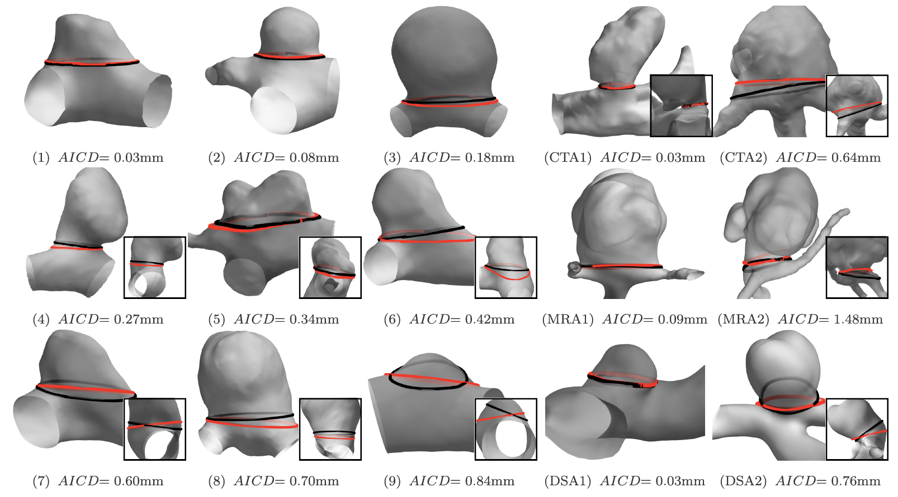

# Automated Cutting Plane Positioning for Intracranial Aneurysm Quantification

This is a MATLAB implementation of the journal publication:

* [T. Jerman, A. Chien, F. Pernus, B. Likar, Z. Spiclin, "*Automated Cutting Plane Positioning for Intracranial Aneurysm Quantification*", IEEE Transactions on Biomedical Engineering, 67(2), p. 577-587 (2019), doi={10.1109/TBME.2019.2918921}](https://doi.org/10.1109/TBME.2019.2918921)

### Input and Requirements:

* Input is a 3d mesh of the aneurysm and its parent vasculature. 

* Note: the ending sections of the vasculature must be open.

* In addition to the code in this repository, the next three MATLAB toolboxes are required:
  * [Toolbox Fast Marching](https://www.mathworks.com/matlabcentral/fileexchange/6110-toolbox-fast-marching)

  * [Toolbox Graph](https://www.mathworks.com/matlabcentral/fileexchange/5355-toolbox-graph)

  * [Toolbox General - taken from A Numerical Tour of Signal Processing](https://www.mathworks.com/matlabcentral/fileexchange/9554-a-numerical-tour-of-signal-processing?focused=5130146&tab=function)

### How to run:

* See example file: **examplePlaneComputation.m**

* The code is divided into three main functions:
  * aneurysm center and parent vessel centerline extraction
  * extraction of aneurysm principle direction
  * positioning of aneurysm neck plane
  
### Warning:

This code is part of a research project and is currently in an undocumented and unpolished state. Consequently, reading and interpreting the code could be highly difficult.

